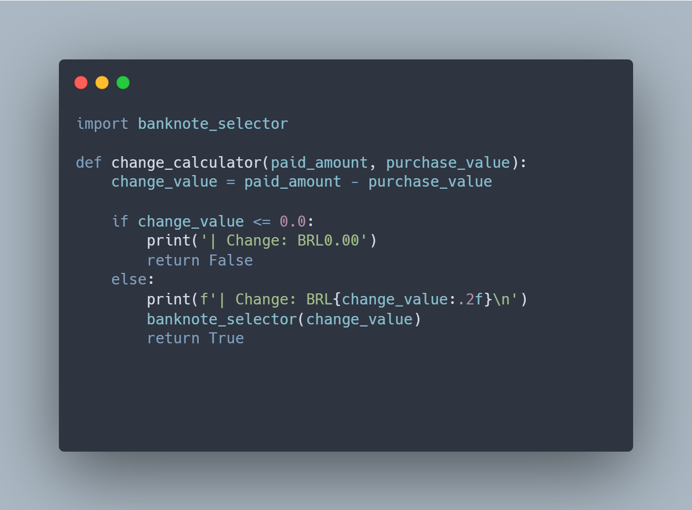

# Change Calculator

Change Calculator is going to calculate the change to pay to the client after the payment. And also select the smallest combination of banknotes and coins with banknotes_selector.py  

 
 

### _Code working:_

